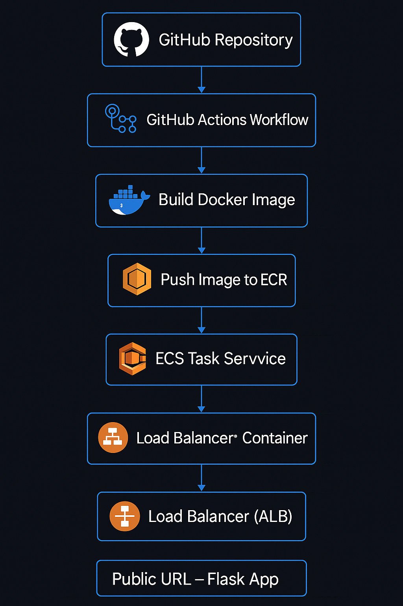

# Architecture: GitHub Actions + Docker + AWS ECR + ECS

## Overview
This project implements a CI/CD pipeline for a Flask web application. The application is containerized using Docker, stored in AWS ECR, and deployed to an AWS ECS cluster running on Fargate. GitHub Actions orchestrates the entire build and deployment process.

## CI/CD Pipeline

## Explanation

1.  **GitHub Repository (`A`)**: The source code for the Flask application and the GitHub Actions workflow configuration (`cicd.yml`) are stored here.
2.  **GitHub Actions Workflow (`B`)**: Triggered by a push to the `main` branch, this workflow automates the build, push, and deploy steps.
3.  **Build Docker Image (`C`)**: The workflow uses the `Dockerfile` in the repository to build a Docker image of the Flask application.
4.  **Push Image to ECR (`D`)**: The built image is tagged (e.g., with the commit hash) and pushed to a specified AWS ECR repository.
5.  **Update ECS Service (`E`)**: The workflow updates the ECS service definition to use the new image tag, triggering ECS to launch new tasks with the updated image and terminate old ones.
6.  **ECS Task Running Container (`F`)**: ECS Fargate runs the Docker container based on the task definition, which specifies the image from ECR.
7.  **Load Balancer (ALB) (`G`)**: An Application Load Balancer (ALB) distributes traffic to the running ECS tasks.
8.  **Public URL (`H`)**: The application is accessible via the DNS name of the ALB.
