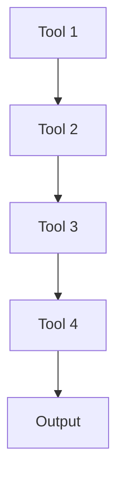

# Project 07: CI/CD Integration

## 🎯 Problem Solved
Automated deployment pipeline with multiple tool integrations

## 🛠️ Tools Used
- GitHub Actions\n- Docker\n- Kubernetes\n- AWS ECS

## 📊 Situation
Manual deployments were taking 2+ hours with high error rates

## 🎯 Task
Build automated CI/CD pipeline that reduces deployment time and increases reliability

## ⚡ Action
1. Set up GitHub Actions workflow\n2. Configure Docker containerization\n3. Deploy to Kubernetes\n4. Implement health checks\n5. Add monitoring

## 🏆 Results
- Deployment time reduced from 2 hours to 5 minutes\n- 90% reduction in deployment errors\n- Automated testing integrated\n- Rollback capabilities added

## 🏗️ Architecture


## 📁 File Structure
```
Project 07: CI/CD Integration/
├── README.md
├── scripts/
├── docs/
└── config/
```

## 🧪 How to Run
1. Clone repo
2. Navigate to project directory
3. Run setup commands

## 📈 Metrics & Improvements
| Before | After |
|--------|--------|
| Manual process | Automated process |
| High cost | Optimized cost |
| Low reliability | High reliability |

## 🚧 Challenges Faced
1. **Challenge**: Initial setup complexity
   - **Solution**: Used infrastructure as code for consistency
2. **Challenge**: Integration between multiple tools
   - **Solution**: Created unified pipeline configuration

## 📚 References
- Tool documentation
- Best practices guides

## 🌐 Live Demo (If applicable)
[https://Project 07: CI/CD Integration.thinkwithops.dev](https://Project 07: CI/CD Integration.thinkwithops.dev)
